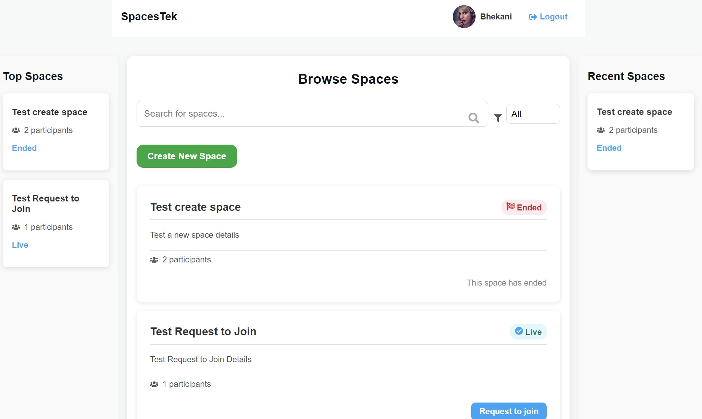

<p align="center">
  
</p>

<p align="center">
  <a href="https://twitter.com/media_sfu">
    
  </a>
  <a href="https://www.mediasfu.com/forums">
    
  </a>
  <a href="https://github.com/MediaSFU">
    
  </a>
  <a href="https://www.mediasfu.com/">
    
  </a>
  <a href="https://www.youtube.com/channel/UCELghZRPKMgjih5qrmXLtqw">
    
  </a>
</p>

MediaSFU offers a cutting-edge streaming experience that empowers users to customize their recordings and engage their audience with high-quality streams. Whether you're a content creator, educator, or business professional, MediaSFU provides the tools you need to elevate your streaming game.

---

# SpacesTek Final

Welcome to the **SpacesTek Final** repository! This monorepo represents the complete, feature-rich implementation of MediaSFU's packages for various frameworks, demonstrating dynamic room creation, media controls, and seamless backend integration.

## SpacesTek Overview

**SpacesTek** provides a scalable platform for creating audio-visual spaces tailored to diverse use cases such as webinars, discussions, and collaborative events. With advanced features like real-time video handling, participant management, and audio visualization, this final iteration takes user interaction to the next level.

---

## Getting Started

Before diving into SpacesTek Final, if you’re new to our ecosystem, we highly recommend starting with our [SpacesTekInitial](https://youtu.be/-S-Lahxf-P0) introduction. This video provides a quick overview and hands-on guide to get you started.  
  
[](https://youtu.be/-S-Lahxf-P0)

Once you’re comfortable with the basics, you can explore the more advanced features in SpacesTek Final. And for even more advanced use cases, check out our [SpacesTekAdvanced](https://github.com/MediaSFU/SpacesTekAdvanced) repository.

---

## Table of Contents

- [Available Applications](#available-applications)
  - [MediaSFU ReactJS](./mediasfu_reactjs/README.md)
  - [MediaSFU React Native](./mediasfu_react_native/README.md)
  - [MediaSFU React Native Expo](./mediasfu_react_native_expo/README.md)
  - [MediaSFU Flutter](./mediasfu_flutter/README.md)
  - [MediaSFU Angular](./mediasfu_angular/README.md)
- [Backend Service](#backend-service)
- [Key Features](#key-features)
- [SpacesTek Visual Showcase](#spacestek-visual-showcase)
- [Getting Started](#getting-started)
- [Contributing](#contributing)
- [License](#license)

---

## Available Applications

Explore the full-featured applications built on MediaSFU:

- **[MediaSFU ReactJS](./mediasfu_reactjs/README.md)**: A robust ReactJS web application integrating dynamic media controls and API-backed space management.
- **[MediaSFU React Native](./mediasfu_react_native/README.md)**: A cross-platform mobile app for Android and iOS built using React Native.
- **[MediaSFU React Native Expo](./mediasfu_react_native_expo/README.md)**: React Native application with Expo, offering rapid development and deployment.
- **[MediaSFU Flutter](./mediasfu_flutter/README.md)**: A cross-platform mobile application built using Flutter with advanced media handling.
- **[MediaSFU Angular](./mediasfu_angular/README.md)**: Angular web application integrating custom grids and advanced video functionalities.

---

## Backend Service

The SpacesTek backend is a modular Node.js server providing APIs for managing user profiles, spaces, and participant actions. Designed for extensibility, the backend supports full-stack development with real-time updates.

### Features

- **Real-Time Media Control**: Synchronize media actions across participants with backend APIs.
- **Profile and Space Management**: Create, update, and manage user profiles and spaces.
- **Extendable Database**: Replace the mock `db.json` with production-ready databases.

---

## Key Features

### Dynamic Media Management
- **Audio and Video Controls**: Mute/unmute, toggle video streams, and switch cameras.
- **Participant Actions**: Manage participants with roles, permissions, and real-time updates.

### Advanced Video Features
- **Custom Video Grids**: Dynamic layouts with responsive designs.
- **Media Transformations**: Apply overlays and effects to video streams.

### Cross-Platform Integration
- **Web and Mobile**: Seamless support for Angular, ReactJS, Flutter, and React Native.
- **Backend API Sync**: Ensure real-time synchronization between client and server.

---

## SpacesTek Visual Showcase

Here’s a visual walkthrough of SpacesTek. These images represent various features and user interfaces of the platform:

<div style="display: grid; grid-template-columns: 1fr 1fr; gap: 16px; margin: 20px 0;">
  <div>
    
    <p style="text-align: center;">Create Space</p>
  </div>
  <div>
    
    <p style="text-align: center;">User Login</p>
  </div>
  <div>
    
    <p style="text-align: center;">Space Details</p>
  </div>
  <div>
    
    <p style="text-align: center;">Browse Spaces</p>
  </div>
</div>

---

## Getting Started

1. **Clone the Repository**:
   ```bash
   git clone https://github.com/MediaSFU/SpacesTekFinal.git
   cd SpacesTekFinal
   ```

2. **Choose Your Framework**:
   - Navigate to the desired application directory (e.g., `mediasfu_reactjs`, `mediasfu_angular`) to begin setup.

---

## Video Guides for SDK Integration

To help you connect your MediaSFU SDKs to the Community Edition server, we’ve prepared video guides for the frameworks currently supported:

### ✅ Video Guides Available:
- **React SDK Setup:** [Watch the React SDK Setup Guide](https://youtu.be/VvulSNB_AYg)
  
  [](https://www.youtube.com/watch?v=VvulSNB_AYg)
  
- **Flutter SDK Setup:** [Watch the Flutter SDK Setup Guide](https://youtu.be/IzwVEMBQ3p0)
  
  [](https://www.youtube.com/watch?v=IzwVEMBQ3p0)

- **React Native SDK Setup (Expo & CLI):** [Watch the React Native SDK Setup Guide](https://youtu.be/uJkI7H26jq4)  
  [](https://www.youtube.com/watch?v=uJkI7H26jq4)

### 🚧 Coming Soon:
- **Angular SDK Setup**

---

## Contributing

We welcome contributions to improve SpacesTek! Please read our [Contribution Guidelines](CONTRIBUTING.md) to get started.

---

## License

This project is licensed under the [MIT License](LICENSE).
